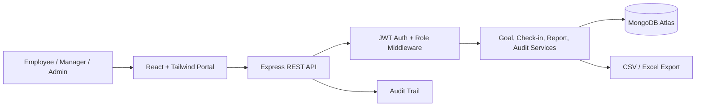

# Goal Setting & Tracking Portal

Prize-focused full-stack portal for company goal planning, manager approvals, quarterly check-ins, progress tracking, audit logs, and CSV/Excel-ready reporting.

## Tech Stack

- Frontend: React, Vite, Tailwind CSS
- Backend: Node.js, Express
- Database: MongoDB Atlas with a local in-memory demo fallback
- Authentication: JWT with role-based access control

## Roles

- Employee: create goals, submit goal plan, update quarterly check-ins, track planned vs actual
- Manager: review team submissions, approve/reject plans, monitor team progress
- Admin: view organization analytics, audit trail, reports, and all users/goals

## Quick Start

```bash
npm run install:all
cp server/.env.example server/.env
npm run dev
```

Frontend: `http://localhost:5173`

Backend: `http://localhost:5000`

The app works immediately in demo mode if `MONGODB_URI` is not set. For MongoDB Atlas, set `MONGODB_URI` in `server/.env`.

## Demo Logins

| Role | Email | Password |
| --- | --- | --- |
| Employee | employee@atomquest.demo | Password@123 |
| Manager | manager@atomquest.demo | Password@123 |
| Admin | admin@atomquest.demo | Password@123 |

## Architecture



## API Summary

- `POST /api/auth/login`
- `GET /api/auth/me`
- `GET /api/dashboard`
- `GET /api/goals`
- `POST /api/goals`
- `POST /api/goals/submit`
- `PATCH /api/goals/:id/status`
- `PATCH /api/goals/:id/approval`
- `POST /api/goals/:id/checkins`
- `GET /api/reports/goals.csv`
- `GET /api/audit`

## Deployment

1. Create a MongoDB Atlas cluster and database user.
2. Add these backend environment variables:
   - `MONGODB_URI`
   - `JWT_SECRET`
   - `CLIENT_URL`
   - `PORT`
3. Deploy `server` on Render/Railway:
   - Build command: `npm install`
   - Start command: `npm start`
4. Deploy `client` on Vercel/Netlify:
   - Build command: `npm run build`
   - Output directory: `dist`
   - Environment variable: `VITE_API_URL=https://your-backend-url`

