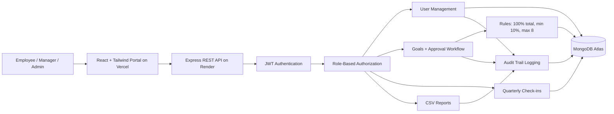

# GoalTrack Portal

> **AtomQuest Hackathon 2026 Submission**  
> A production-ready goal setting and tracking portal for company performance management.

GoalTrack Portal is a full-stack web application that helps companies manage employee goals, manager approvals, quarterly check-ins, planned vs actual tracking, audit logs, and CSV reports. It is built with a real organizational workflow in mind: admins create users, employees submit goals, managers approve them, and leadership can track progress with clean dashboards.

## Project Links

| Item | Link |
| --- | --- |
| Live Portal | https://atom-quest-hackathon-2026.vercel.app |
| Demo Video | https://drive.google.com/file/d/1BIArt6hepFyXAD-lps8dk-DRULDdAZ5x/view?usp=sharing |
| Backend API | https://atomquest-hackathon-2026-pgnl.onrender.com |
| Health Check | https://atomquest-hackathon-2026-pgnl.onrender.com/api/health |
| Source Code | https://github.com/ankita7Patil/AtomQuest-Hackathon-2026 |

## Why This Project

Companies often manage goals through spreadsheets, email threads, and disconnected review notes. GoalTrack Portal brings the whole process into one structured platform:

- Admins can create and manage real users.
- Employees can create validated goal plans.
- Managers can approve or reject submitted goals.
- Quarterly check-ins keep progress measurable.
- Reports and audit logs make the system transparent.

## Evaluator Credentials

| Role | Email | Password |
| --- | --- | --- |
| Admin | admin@atomquest.com | Admin@12345 |
| Manager | manager2@test.com | Manager@123 |
| Employee | employee2@test.com | Employee@123 |

## Core Workflow

```text
Admin creates users -> Employee creates goals -> Employee submits plan -> Manager approves/rejects -> Employee updates quarterly progress -> Admin exports reports
```

## Tech Stack

| Layer | Technology |
| --- | --- |
| Frontend | React, Vite, Tailwind CSS |
| Backend | Node.js, Express.js |
| Database | MongoDB Atlas |
| Authentication | JWT |
| Deployment | Vercel frontend, Render backend |
| Reports | CSV export compatible with Excel |

## Key Features

- JWT login authentication
- Role-based dashboards for Admin, Manager, and Employee
- Admin user management for creating managers, employees, and admins
- Goal creation and submission
- Goal validation:
  - Total weightage must be exactly 100%
  - Minimum weightage per goal is 10%
  - Maximum 8 goals per plan
- Manager approval and rejection workflow
- Quarterly check-ins for Q1, Q2, Q3, and Q4
- Planned vs actual tracking
- Status updates: Not Started, On Track, Completed
- Shared goals support in the database model
- Weighted progress calculation
- Audit trail logging
- CSV report export
- Responsive modern UI
- Clean REST API architecture
- MongoDB Atlas schemas for users, goals, check-ins, and audit logs

## Role-Based Experience

### Admin

- Creates managers, employees, and other admins
- Assigns employees to managers
- Monitors organization-level goal progress
- Views audit trail activity
- Exports CSV reports

### Employee

- Creates goal plans with title, description, planned progress, status, and weightage
- Submits only valid goal plans with 100% total weightage
- Updates quarterly planned vs actual progress
- Tracks goal status over time

### Manager

- Views submitted goals from assigned employees
- Approves or rejects goals
- Tracks team workflow health
- Exports reports for review

## Architecture



## REST API

| Method | Endpoint | Purpose |
| --- | --- | --- |
| POST | `/api/auth/login` | Login and receive JWT |
| GET | `/api/auth/me` | Get current authenticated user |
| GET | `/api/dashboard` | Role-based dashboard metrics |
| GET | `/api/users` | List users for admin/manager |
| POST | `/api/users` | Admin creates user |
| GET | `/api/goals` | List role-visible goals |
| POST | `/api/goals` | Create goal |
| POST | `/api/goals/submit` | Submit goal plan |
| PATCH | `/api/goals/:id/approval` | Manager approves/rejects goal |
| PATCH | `/api/goals/:id/status` | Update goal status |
| POST | `/api/goals/:id/checkins` | Add/update quarterly check-in |
| GET | `/api/reports/goals.csv` | Export CSV report |
| GET | `/api/audit` | View audit logs |

## Local Setup

```bash
npm run install:all
copy server\.env.example server\.env
npm run dev
```

Frontend:

```text
http://localhost:5173
```

Backend:

```text
http://localhost:5000
```

If `MONGODB_URI` is not set, the backend can run with local in-memory demo data for development. For real deployment, use MongoDB Atlas.

## Environment Variables

Backend `server/.env`:

```env
PORT=5000
CLIENT_URL=http://localhost:5173
JWT_SECRET=replace-with-a-long-random-secret
MONGODB_URI=your-mongodb-atlas-uri
ADMIN_NAME=Company Admin
ADMIN_EMAIL=admin@yourcompany.com
ADMIN_PASSWORD=ChangeMe123!
```

Frontend:

```env
VITE_API_URL=http://localhost:5000
```

## Deployment

### Render Backend

- Root directory: `server`
- Build command: `npm install`
- Start command: `npm start`
- Required environment variables:
  - `MONGODB_URI`
  - `JWT_SECRET`
  - `CLIENT_URL`
  - `ADMIN_NAME`
  - `ADMIN_EMAIL`
  - `ADMIN_PASSWORD`
  - `NODE_ENV=production`

### Vercel Frontend

- Root directory: `client`
- Framework preset: Vite
- Build command: `npm run build`
- Output directory: `dist`
- Environment variable:

```env
VITE_API_URL=https://atomquest-hackathon-2026-pgnl.onrender.com
```

## Hackathon Evaluation Fit

- **Functionality:** Complete user, goal, approval, check-in, tracking, audit, and export workflow.
- **Problem alignment:** Covers the requested three roles, validations, REST APIs, MongoDB schemas, and deployment readiness.
- **User friendliness:** Simple dashboards, clear metrics, responsive layout, and role-specific actions.
- **Technical robustness:** JWT middleware, role protection, backend validation, centralized errors, and MongoDB Atlas persistence.
- **Cost optimization:** Uses free-tier-friendly Vercel, Render, and MongoDB Atlas deployment.

## Demo Story

The recommended demo flow is:

1. Login as Admin and create users.
2. Login as Employee and create goals with 100% total weightage.
3. Submit the employee goal plan.
4. Login as Manager and approve submitted goals.
5. Login as Employee and update quarterly progress.
6. Login as Admin and export the CSV report.
