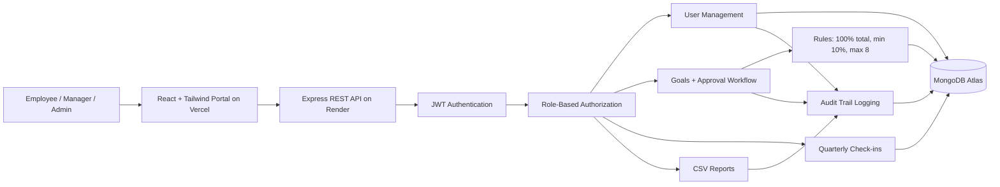

# AtomQuest Hackathon 2026 Submission

## Project Title

**GoalTrack Portal - Company Goal Setting & Tracking Platform**

## Project Overview

GoalTrack Portal is a full-stack company goal management system built for structured performance planning, manager approval, quarterly check-ins, and transparent progress tracking. The portal supports real company users across three roles: **Admin**, **Manager**, and **Employee**.

The solution is designed for a real organizational workflow:

```text
Admin creates users -> Employee creates goals -> Employee submits plan -> Manager approves/rejects -> Employee updates quarterly progress -> Admin exports reports
```

## Live Working Links

| Item | Link |
| --- | --- |
| Deployed Frontend | https://atom-quest-hackathon-2026.vercel.app |
| Deployed Backend | https://atomquest-hackathon-2026-pgnl.onrender.com |
| Backend Health Check | https://atomquest-hackathon-2026-pgnl.onrender.com/api/health |
| Source Code Repository | https://github.com/ankita7Patil/AtomQuest-Hackathon-2026 |

## Evaluator Login Credentials

| Role | Email | Password |
| --- | --- | --- |
| Admin | admin@atomquest.com | Admin@12345 |
| Manager | manager2@test.com | Manager@123 |
| Employee | employee2@test.com | Employee@123 |

> Note: The admin can create additional managers, employees, and admins from the User Management panel.

## Tech Stack

| Layer | Technology |
| --- | --- |
| Frontend | React, Vite, Tailwind CSS |
| Backend | Node.js, Express.js |
| Database | MongoDB Atlas |
| Authentication | JWT |
| Deployment | Vercel frontend, Render backend |
| Reporting | CSV export compatible with Excel |

## Features Implemented

- JWT-based login authentication
- Role-based access for Admin, Manager, and Employee
- Admin user management for creating real company users
- Employee goal creation and submission
- Goal validation rules:
  - Total goal weightage must be exactly 100%
  - Minimum weightage per goal is 10%
  - Maximum 8 goals per plan
- Manager approval and rejection workflow
- Quarterly check-ins for Q1, Q2, Q3, and Q4
- Planned vs actual tracking
- Status updates: Not Started, On Track, Completed
- Shared goals support in the database model
- Weighted progress calculation
- Audit trail logging for important user and goal actions
- CSV export for management reporting
- Responsive professional UI
- Clean REST API architecture
- MongoDB Atlas schemas for users, goals, check-ins, and audit logs
- Deployment-ready environment configuration

## Role-Based Workflow

### Admin

- Logs in using the first admin account
- Creates managers, employees, and other admins
- Assigns employees to managers
- Views organization-level metrics
- Reviews audit trail activity
- Exports goal reports as CSV

### Employee

- Logs in with credentials created by the admin
- Creates goal plans with title, description, planned progress, weightage, and status
- Submits goals only when weightage validation passes
- Updates quarterly planned vs actual progress
- Changes goal status as work progresses

### Manager

- Views goals submitted by assigned employees
- Approves or rejects submitted goals
- Tracks team progress and workflow health
- Exports reports for review

## Architecture Diagram



## REST API Summary

| Method | Endpoint | Purpose |
| --- | --- | --- |
| POST | `/api/auth/login` | Login and receive JWT |
| GET | `/api/auth/me` | Get current user |
| GET | `/api/dashboard` | Role-based dashboard metrics |
| GET | `/api/users` | List users for admin/manager |
| POST | `/api/users` | Admin creates user |
| GET | `/api/goals` | List role-visible goals |
| POST | `/api/goals` | Create goal |
| POST | `/api/goals/submit` | Submit goal plan |
| PATCH | `/api/goals/:id/approval` | Manager approves/rejects goal |
| PATCH | `/api/goals/:id/status` | Update goal status |
| POST | `/api/goals/:id/checkins` | Add/update quarterly check-in |
| GET | `/api/reports/goals.csv` | Export CSV report |
| GET | `/api/audit` | View audit logs |

## Deployment Details

### Frontend

- Platform: Vercel
- Root directory: `client`
- Build command: `npm run build`
- Output directory: `dist`
- Environment variable:

```env
VITE_API_URL=https://atomquest-hackathon-2026-pgnl.onrender.com
```

### Backend

- Platform: Render
- Root directory: `server`
- Build command: `npm install`
- Start command: `npm start`
- Environment variables:

```env
MONGODB_URI=<MongoDB Atlas connection string>
JWT_SECRET=<secure JWT secret>
CLIENT_URL=https://atom-quest-hackathon-2026.vercel.app
ADMIN_NAME=Ankita Patil
ADMIN_EMAIL=admin@atomquest.com
ADMIN_PASSWORD=Admin@12345
NODE_ENV=production
```

## Evaluation Highlights

- **Functionality:** Complete role-based goal workflow from user creation to approval and tracking.
- **Problem Alignment:** Implements authentication, dashboards, goal validation, approval, check-ins, planned vs actual tracking, reporting, and audit logs.
- **User Friendliness:** Clean responsive UI with clear metrics, forms, workflow status, and role-specific screens.
- **Technical Robustness:** REST API, JWT middleware, role protection, MongoDB schemas, backend validation, and centralized error handling.
- **Cost Optimization:** Uses free-tier-friendly Render, Vercel, and MongoDB Atlas deployment.

## Final Submission Links

- Working portal: https://atom-quest-hackathon-2026.vercel.app
- Source code: https://github.com/ankita7Patil/AtomQuest-Hackathon-2026
- Backend API: https://atomquest-hackathon-2026-pgnl.onrender.com
