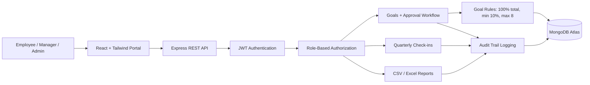

# AtomQuest Hackathon 2026 Submission

## Project

**GoalTrack Portal** is a full-stack Goal Setting & Tracking Portal for companies. It supports employees, managers, and admins with JWT authentication, role-based dashboards, goal validation, approval workflows, quarterly check-ins, shared goals, progress tracking, audit logs, and CSV/Excel-ready report export.

## Working Link

- Local demo: `http://localhost:5173`
- Backend health: `http://localhost:5000/api/health`
- Deployed frontend: `Add your Vercel/Netlify link here`
- Deployed backend: `Add your Render/Railway link here`

## Source Code Repository

- GitHub/GitLab/Bitbucket: `Add your repository URL here`

## Demo Credentials

| Role | Email | Password |
| --- | --- | --- |
| Employee | employee@atomquest.demo | Password@123 |
| Manager | manager@atomquest.demo | Password@123 |
| Admin | admin@atomquest.demo | Password@123 |

## Features Implemented

- Secure login with JWT
- Employee, Manager, and Admin dashboards
- Goal creation and submission
- Goal validation: total weightage must be 100%, each goal must be at least 10%, and maximum 8 goals are allowed
- Manager approval and rejection workflow
- Quarterly check-in system for Q1, Q2, Q3, and Q4
- Planned vs actual tracking
- Status updates: Not Started, On Track, Completed
- Shared goals support
- Weighted progress calculation
- Audit trail logging
- CSV export for reporting
- Responsive React + Tailwind UI
- Clean REST API architecture
- MongoDB Atlas-ready schemas
- Demo fallback data for instant evaluation

## Architecture Diagram

## Deployment Instructions

1. Push the project to GitHub.
2. Create a MongoDB Atlas cluster and copy the connection string.
3. Deploy `server` to Render or Railway.
4. Add backend environment variables: `MONGODB_URI`, `JWT_SECRET`, `CLIENT_URL`, and `PORT`.
5. Deploy `client` to Vercel or Netlify.
6. Add frontend environment variable: `VITE_API_URL=https://your-backend-url`.
7. Replace the working link and repository link in this document before final submission.

